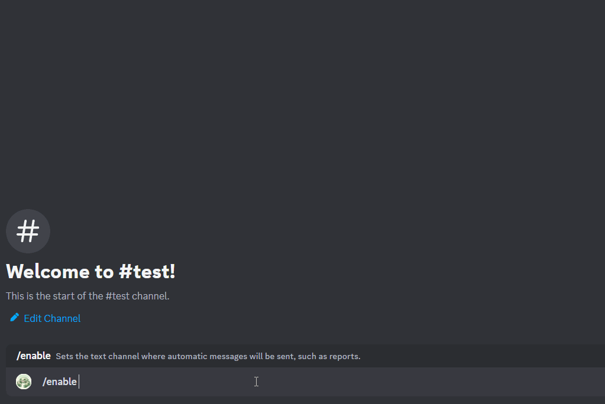

<h1 align="center">
   
  
   
  Scuttle
   
</h1>

<h4 align="center">A League of Legends <a href="https://discord.com/" target="_blank">Discord</a> bot for analyzing player statistics.</h4>

  

  <a href="#key-features">Key Features</a> •
  <a href="#how-to-use">How To Use</a> •
  <a href="#license">License</a>

## Key Features

- Allows discord users to establish a guild of many different LoL players within their server.
  - Each server serves as its own guild where anyone can add a player.
- Regularly fetches and caches LoL match history of every user within a guild
  - Fetching and caching of LoL match data is a process contained within [ScuttleService](https://github.com/eduardoalba00/ScuttleService)
  - When new summoners are added to a guild, data is retreived from the past 30 days
- Sends automated reports to each guild highlighting strengths and weaknesses of its players
  - Users can also manually retreive their reports through commands
  - Reports compare and display the match statistics of every player in a guild.

## How To Use

1. [Add Scuttle](https://discord.com/oauth2/authorize?client_id=1222960533523796089&permissions=17600776293376&scope=bot) to your discord server.
2. Type `/enable` in the channel you wish to receive automated reports
3. Add summoners to your guild using `/summoners add {name} {#tag}`
4. Wait until the start of the next hour before Scuttle has retreived and updated the data for all the Summoners in your Guild.
5. After this initial setup, you will no longer have to wait to get Scuttle's statistics.

## Credits

This software uses the following open source packages:

- [discord.py](https://discordpy.readthedocs.io/en/stable/)

## Support

## License

MIT

---

> GitHub [@eduardoalba00](https://github.com/eduardoalba00) &nbsp;&middot;&nbsp;
